# ✈️ Air Passengers Time Series Forecasting

[](https://www.python.org/)
[](https://streamlit.io/)
[](LICENSE)

A comprehensive time series forecasting project analyzing and predicting air passenger traffic using **SARIMA** and **Prophet** models. This project includes both detailed Jupyter notebook analysis and an interactive Streamlit dashboard for visualization and forecasting.

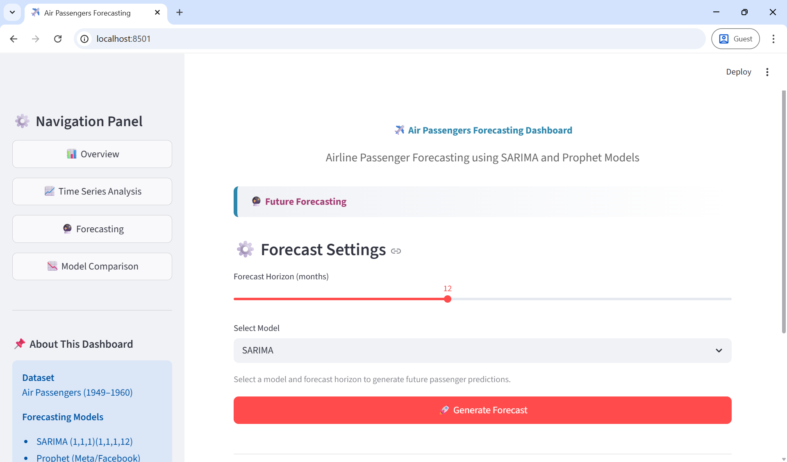
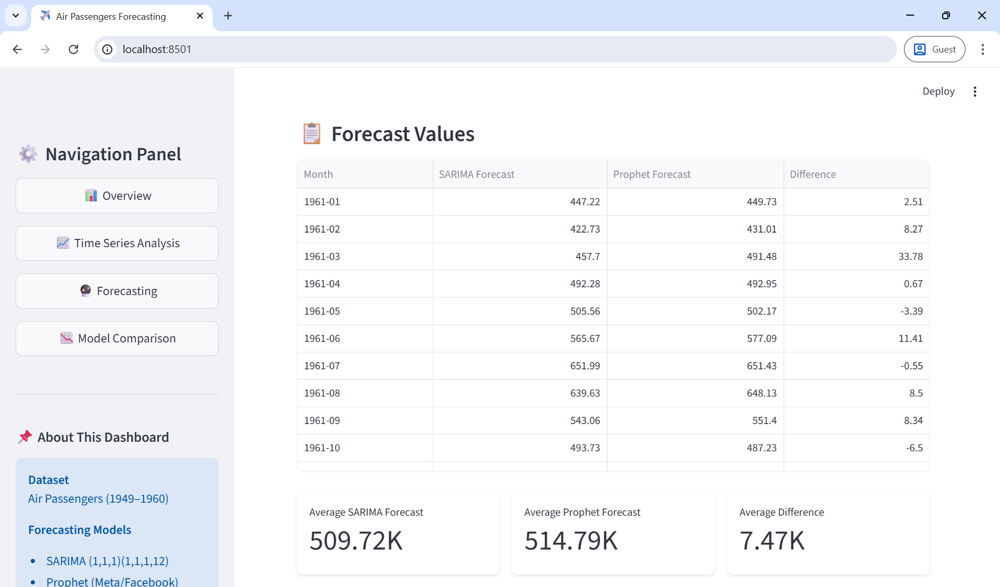
---

## 🌟 Overview

This project demonstrates end-to-end time series forecasting workflow including:
- **Exploratory Data Analysis (EDA)** with statistical tests
- **Time series decomposition** into trend, seasonality, and residuals
- **Stationarity testing** using Augmented Dickey-Fuller (ADF) test
- **Model building** with SARIMA and Prophet
- **Model evaluation** using multiple metrics (MAE, RMSE, MAPE, R²)
- **Interactive dashboard** for real-time forecasting and visualization

---

## 📊 Dataset

**Air Passengers Dataset (1949-1960)**

- **Source**: Classic Box & Jenkins airline passenger dataset
- **Period**: January 1949 - December 1960
- **Frequency**: Monthly
- **Total Observations**: 144 months
- **Target Variable**: Number of airline passengers (in thousands)

### Dataset Statistics

| Metric | Value |
|--------|-------|
| Count | 144 |
| Mean | 280.30 |
| Std Dev | 119.97 |
| Min | 104.00 |
| 25% | 180.00 |
| 50% | 265.50 |
| 75% | 360.50 |
| Max | 622.00 |

---

## 🤖 Models

### 1. SARIMA (Seasonal ARIMA)

**Model Specification**: `SARIMA(1, 1, 1)(1, 1, 1, 12)`

**Parameters**:
- **p=1**: Autoregressive order
- **d=1**: Differencing order (trend removal)
- **q=1**: Moving average order
- **P=1**: Seasonal autoregressive order
- **D=1**: Seasonal differencing order
- **Q=1**: Seasonal moving average order
- **s=12**: Seasonality period (monthly)

**Performance Metrics**:
- MAE: 25.27
- RMSE: 31.79
- MAPE: 5.43%
- R² Score: 0.8345

### 2. Prophet (Facebook Prophet)

**Configuration**:
- Automatic seasonality detection
- Yearly seasonality enabled
- Multiplicative seasonality mode
- 95% confidence intervals

**Performance Metrics**:
- MAE: 18.32
- RMSE: 22.59
- MAPE: 4.06%
- R² Score: 0.9164

### 🏆 Model Comparison

| Metric | SARIMA | Prophet | Winner |
|--------|--------|---------|--------|
| MAE | 25.27 | **18.32** | ✅ Prophet |
| RMSE | 31.79 | **22.59** | ✅ Prophet |
| MAPE | 5.43% | **4.06%** | ✅ Prophet |
| R² Score | 0.8345 | **0.9164** | ✅ Prophet |

**Winner**: Prophet outperforms SARIMA across all metrics with **29% lower RMSE**.

---

## 🚀 Installation

### Prerequisites

- Python 3.8 or higher
- pip package manager

### Step 1: Clone the Repository

```bash
git clone https://github.com/adin-alxndr/air-passengers-forecasting
cd air-passengers-forecasting
```

### Step 2: Create Virtual Environment (Optional but Recommended)

```bash
# Windows
python -m venv venv
venv\Scripts\activate

# Linux/Mac
python3 -m venv venv
source venv/bin/activate
```
---

## 💻 Usage

### Running the Jupyter Notebook

1. **Start Jupyter**:
```bash
jupyter notebook
```

2. **Open the notebook**: Navigate to `forecasting_project.ipynb`

3. **Run all cells**: Execute cells sequentially to:
   - Load and explore data
   - Perform time series decomposition
   - Conduct stationarity tests
   - Train SARIMA and Prophet models
   - Evaluate and compare models
   - Generate forecasts

### Running the Streamlit Dashboard

1. **Ensure models are trained**: Run the Jupyter notebook first to generate model files

2. **Launch the dashboard**:
```bash
streamlit run app.py
```

3. **Access the dashboard**: Open your browser to `http://localhost:8501`

4. **Navigate through pages**:
   - 📊 **Overview**: Dataset statistics and trends
   - 📈 **Time Series Analysis**: Decomposition and insights
   - 🔮 **Forecasting**: Generate future predictions
   - 📉 **Model Comparison**: Performance metrics and evaluation

---

## 📈 Results

### Key Findings

1. **Strong Upward Trend**: Consistent growth in air passenger traffic from 1949 to 1960
2. **Clear Seasonality**: Annual pattern with summer peaks and winter troughs
3. **Non-Stationary Data**: ADF test confirms need for differencing (p-value: 0.9919)
4. **Prophet Superiority**: Prophet model achieves better accuracy across all metrics
5. **Reliable Forecasts**: Both models show R² > 0.83, indicating strong predictive power

### Forecast Accuracy

**Test Set Performance (Last 29 months)**:

| Model | MAE | RMSE | MAPE | R² |
|-------|-----|------|------|-----|
| SARIMA | 25.27 | 31.79 | 5.43% | 0.8345 |
| Prophet | **18.32** | **22.59** | **4.06%** | **0.9164** |

### Sample Forecasts (12 Months Ahead)

| Month | SARIMA | Prophet |
|-------|--------|---------|
| 1961-01 | 447.22 | 449.73 |
| 1961-02 | 422.73 | 431.01 |
| 1961-03 | 457.70 | 491.48 |
| 1961-04 | 492.28 | 492.95 |
| 1961-05 | 505.56 | 502.17 |
| 1961-06 | 565.67 | 577.09 |
| 1961-07 | 651.99 | 651.43 |
| 1961-08 | 639.63 | 648.13 |
| 1961-09 | 543.06 | 551.40 |
| 1961-10 | 493.73 | 487.23 |
| 1961-11 | 426.94 | 422.96 |
| 1961-12 | 470.14 | 471.90 |

---

## 📁 Project Structure

```
air-passengers-forecasting/
│
├── images/                              # Screenshots and visualizations
│   ├── time_series_overview.png
│   ├── decomposition.png
│   ├── acf_pacf.png
│   ├── train_test_split.png
│   ├── sarima_forecast.png
│   └── ...
│
├── app.py                               # Streamlit dashboard application
├── forecasting_project.ipynb       # Jupyter notebook with full analysis
├── air_passengers_data.csv              # Dataset
├── sarima_model.pkl                     # Trained SARIMA model
├── prophet_model.pkl                    # Trained Prophet model
├── model_metrics.pkl                    # Model performance metrics
└── README.md                            # This file

```

---

## 📸 Screenshots

### 1. Time Series Overview
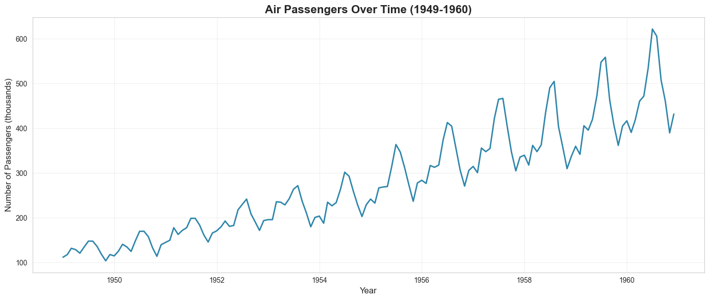

**What it shows:**
- Original air passenger data from 1949 to 1960 (144 monthly observations)
- Clear upward trend indicating consistent growth in air travel
- Strong seasonal patterns with regular annual cycles
- Data ranges from 104K to 622K passengers

**Key insights:**
- 433% growth over 12 years
- Summer peaks (vacation season)
- Winter troughs (off-season)
- Increasing variance over time (multiplicative seasonality)

---

### 2. Time Series Decomposition
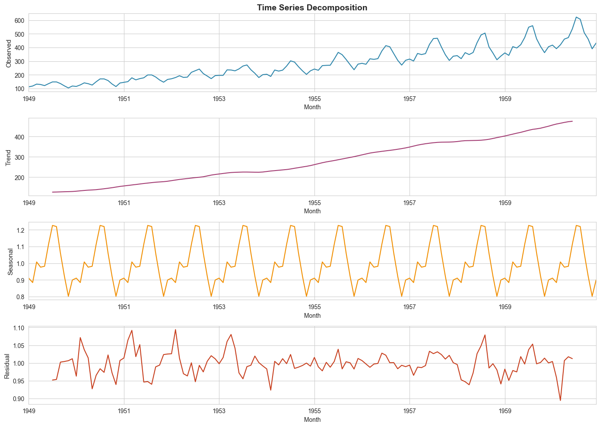

**What it shows:**
- **Top panel (Observed)**: Original time series data
- **Second panel (Trend)**: Long-term increasing pattern (linear growth from ~130K to ~500K)
- **Third panel (Seasonal)**: Repeating 12-month cycle (multiplicative factor ranging 0.8-1.3)
- **Bottom panel (Residual)**: Random fluctuations after removing trend and seasonality

**Key insights:**
- Trend is almost perfectly linear - stable growth rate
- Seasonality is consistent and predictable across all years
- Residuals appear random (good model fit indicator)
- Multiplicative model used (variance increases with level)

---

### 3. ACF & PACF Analysis
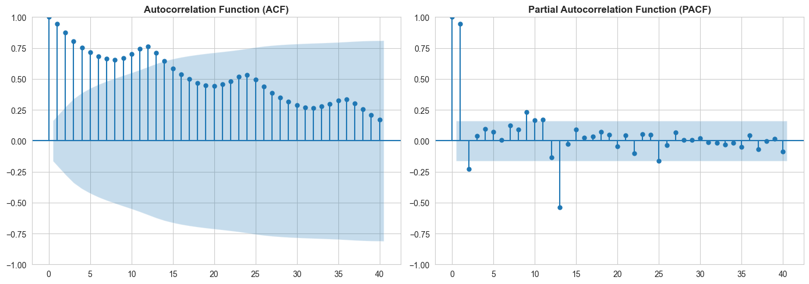

**What it shows:**
- **Left plot (ACF)**: Autocorrelation Function
  - High correlation at all lags (slowly decaying)
  - Strong peaks at multiples of 12 (seasonal correlation)
  - Values gradually decrease but remain significant
- **Right plot (PACF)**: Partial Autocorrelation Function
  - Significant spike at lag 1
  - Sharp cutoff after lag 1
  - Some significant values at seasonal lags (12, 24)

**Key insights:**
- ACF pattern indicates non-stationarity (need for differencing)
- PACF suggests AR(1) component (p=1)
- Seasonal spikes at lag 12 confirm 12-month seasonality
- These plots guided SARIMA(1,1,1)(1,1,1,12) parameter selection

---

### 4. Train-Test Split
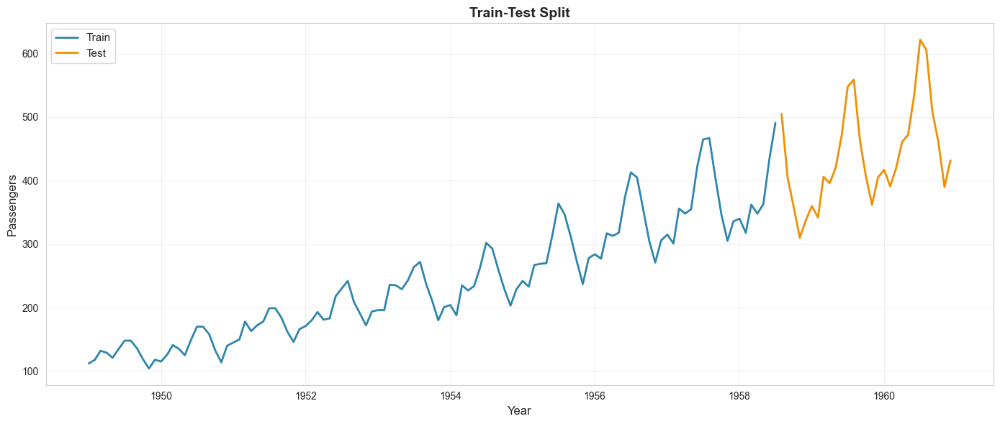

**What it shows:**
- **Blue line**: Training data (Jan 1949 - Jul 1958) = 115 months
- **Orange line**: Test data (Aug 1958 - Dec 1960) = 29 months
- Clear separation at mid-1958
- Test set covers 20% of data, ~2.5 years

**Key insights:**
- Training set: 80% of data (115 observations)
- Test set: 20% of data (29 observations)
- Test period includes multiple seasonal cycles for robust evaluation
- Split preserves chronological order (no data leakage)

---

### 5. SARIMA Forecast vs Actual
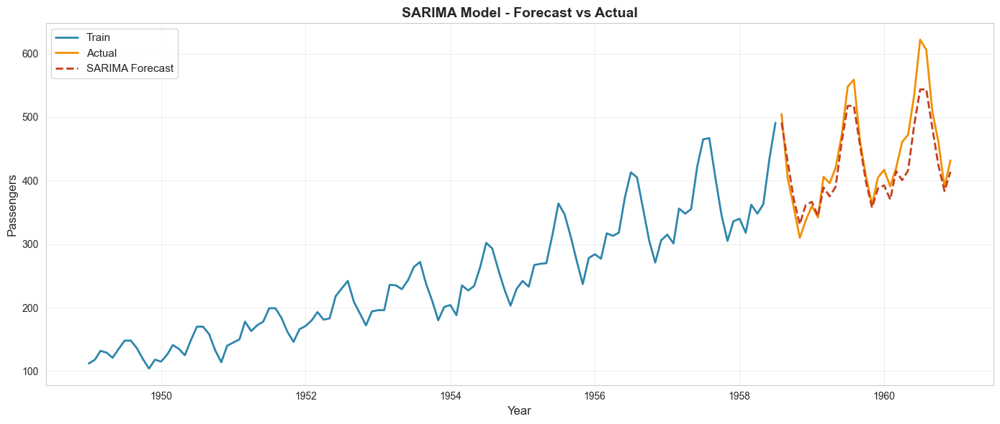

**What it shows:**
- **Blue line**: Training data (ground truth)
- **Orange line**: Actual test values
- **Red dashed line**: SARIMA predictions on test set
- Model captures seasonal patterns well
- Some deviation from actual values, especially at peaks

**Performance metrics:**
- MAE: 25.27 (average error ~25,000 passengers)
- RMSE: 31.79 (penalizes larger errors)
- MAPE: 5.43% (average 5.43% error)
- R²: 0.8345 (explains 83.45% of variance)

**Key insights:**
- SARIMA captures overall trend and seasonality
- Tends to slightly underestimate peaks
- Good baseline statistical model
- Interpretable parameters

---

### 6. Prophet Forecast with Full Timeline
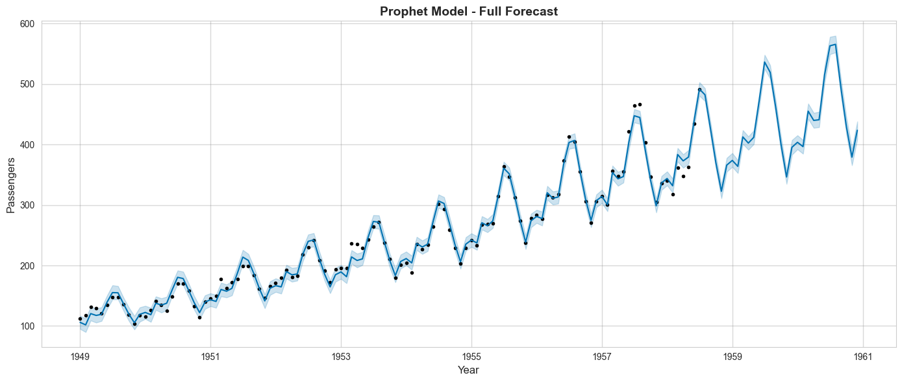

**What it shows:**
- **Blue line**: Complete historical data (training + actual test)
- **Black dots**: Actual observations overlaid on forecast
- **Light blue line**: Prophet's forecast across entire timeline
- **Shaded area**: 95% confidence intervals
- Smooth fit that captures trend and seasonality

**Key insights:**
- Prophet provides uncertainty quantification (confidence bands)
- Model fits historical data very well
- Handles trend changes smoothly
- Wider confidence intervals as forecast horizon extends
- More flexible than SARIMA in capturing non-linear patterns

---

### 7. Model Comparison on Test Set
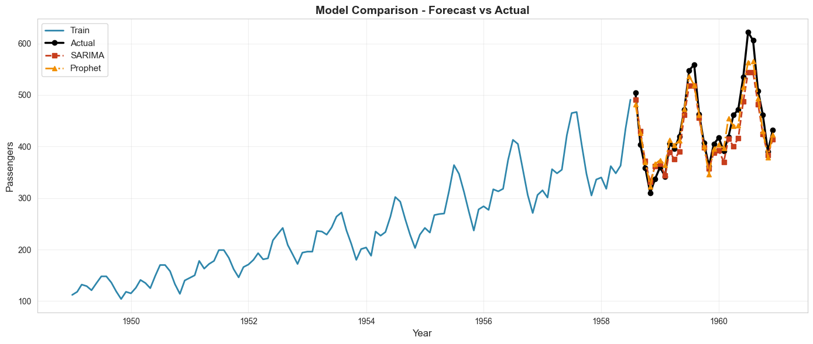

**What it shows:**
- **Blue line**: Training data
- **Black line**: Actual test values (ground truth)
- **Red line**: SARIMA predictions
- **Orange line**: Prophet predictions
- Both models overlay on same plot for direct comparison

**Visual comparison:**
- Prophet (orange) tracks actual values more closely
- SARIMA (red) shows more deviation, especially at extremes
- Prophet handles peaks better
- Both capture seasonality patterns
- Prophet's flexibility advantage is visible

**Performance winner:**
- Prophet outperforms on all metrics
- 29% lower RMSE (22.59 vs 31.79)
- 27% lower MAE (18.32 vs 25.27)
- 9.8% higher R² (0.9164 vs 0.8345)

---

### 8. 12-Month Future Forecast
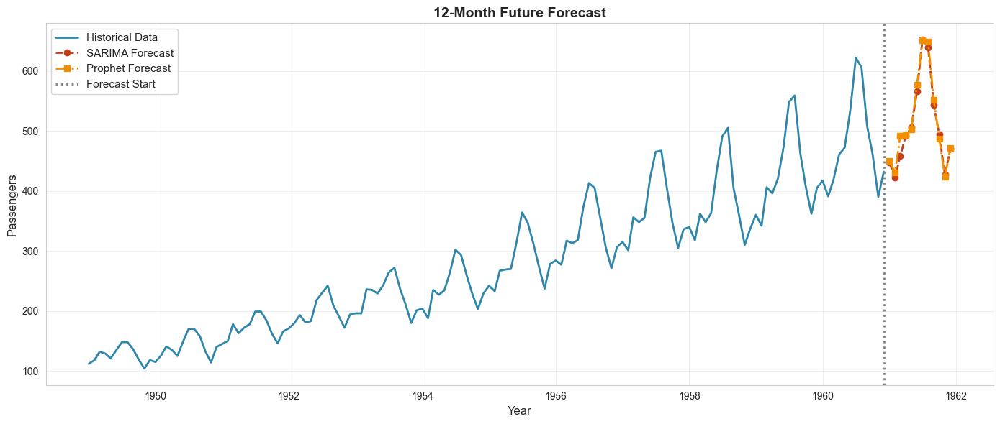

**What it shows:**
- **Blue line**: All historical data (1949-1960)
- **Red dots/line**: SARIMA 12-month forecast (Jan-Dec 1961)
- **Orange dots/line**: Prophet 12-month forecast (Jan-Dec 1961)
- **Vertical dotted line**: Forecast start point (Jan 1961)
- Both models predicting into future (beyond available data)

**Forecast values (sample):**
- Jan 1961: SARIMA=447K, Prophet=450K
- Jul 1961: SARIMA=652K, Prophet=651K (peak month)
- Dec 1961: SARIMA=470K, Prophet=472K

**Key insights:**
- Both models predict continued growth
- Seasonal pattern preserved (summer peaks)
- Forecasts very similar (models agree on trend)
- Expected range: 420K-650K passengers
- Prophet provides uncertainty intervals (not shown here)

---

## 🎨 Dashboard Screenshots

The interactive Streamlit dashboard provides 5 main pages:

1. **Overview**: Dataset statistics, trends, and insights
   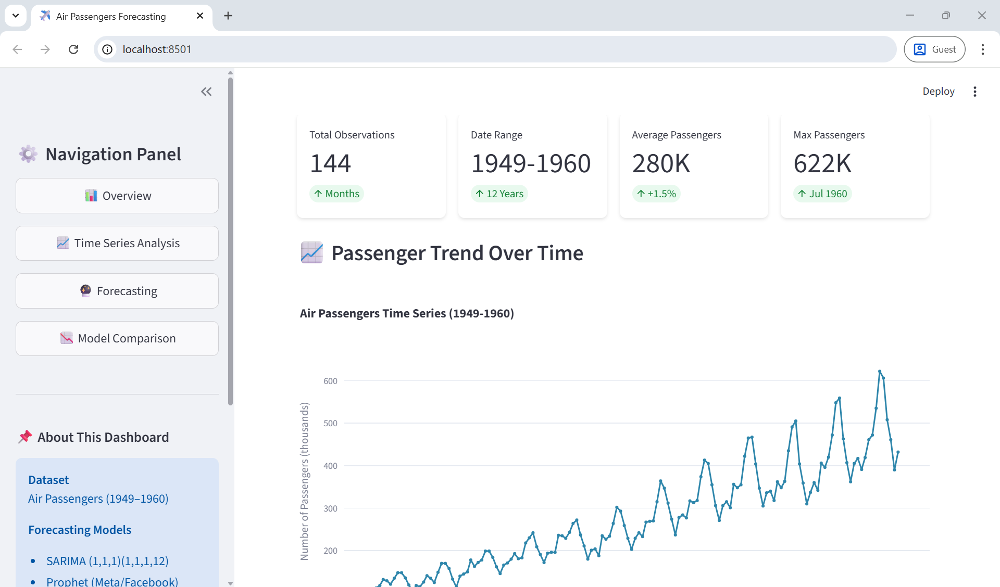
2. **Time Series Analysis**: Decomposition visualization
   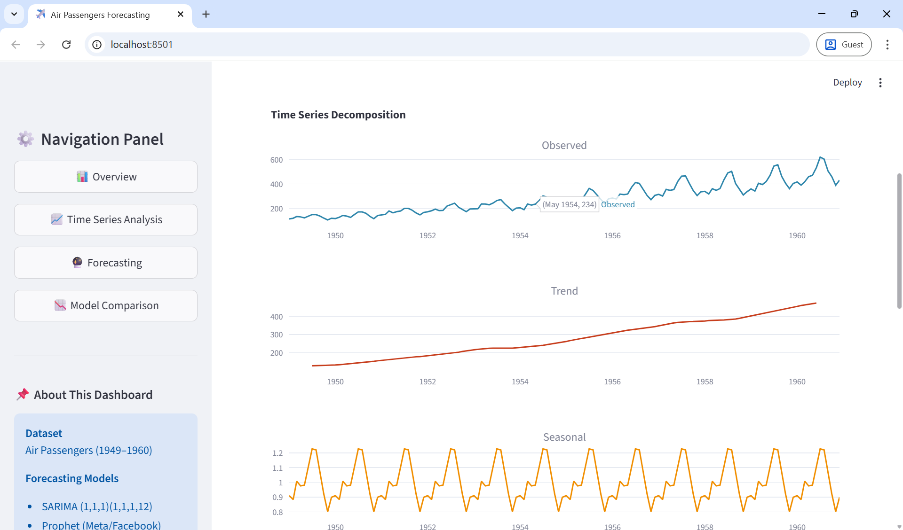
3. **Forecasting**: Interactive prediction with configurable horizon
   
4. **Model Comparison**: Performance metrics and visual comparisons
   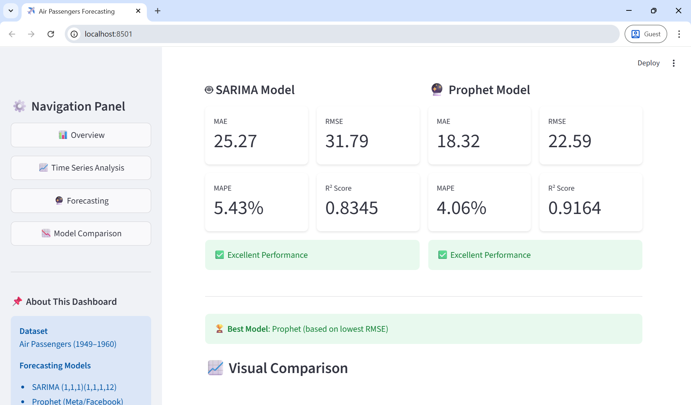

---

## 🛠️ Technologies Used

### Programming & Data Science
- **Python 3.8+**: Core programming language
- **Pandas**: Data manipulation and analysis
- **NumPy**: Numerical computations
- **Statsmodels**: Statistical modeling and SARIMA implementation

### Machine Learning
- **Prophet**: Facebook's time series forecasting library
- **Scikit-learn**: Model evaluation metrics

### Visualization
- **Matplotlib**: Static plots and visualizations
- **Seaborn**: Statistical data visualization
- **Plotly**: Interactive charts and graphs

### Web Application
- **Streamlit**: Interactive dashboard framework

### Development Tools
- **Jupyter Notebook**: Interactive development and analysis
- **Git**: Version control

---

## 🧪 Methodology

### 1. Data Exploration
- Load and inspect dataset
- Calculate descriptive statistics
- Visualize time series patterns

### 2. Stationarity Testing
- Perform ADF test
- Analyze results (p-value: 0.9919 → Non-stationary)
- Determine need for differencing

### 3. Time Series Decomposition
- Decompose into trend, seasonal, and residual
- Identify seasonality period (12 months)
- Analyze component patterns

### 4. Model Selection
- Plot ACF and PACF
- Determine ARIMA parameters
- Configure SARIMA (1,1,1)(1,1,1,12)
- Set up Prophet with automatic seasonality

### 5. Model Training
- Split data: 80% train (115 months), 20% test (29 months)
- Train SARIMA model
- Train Prophet model
- Save trained models

### 6. Model Evaluation
- Calculate MAE, RMSE, MAPE, R²
- Compare model performance
- Visualize predictions vs actual

### 7. Forecasting
- Generate 12-month ahead forecasts
- Create confidence intervals
- Export results

---

## 🎯 Key Insights

### Data Characteristics
- **Strong Growth**: 433% increase over 12 years
- **Seasonality**: 12-month cycle with summer peaks
- **Variance**: Increasing variance over time (multiplicative seasonality)

### Model Insights
- **SARIMA**: Good for interpretability, captures seasonality well
- **Prophet**: Better accuracy, handles trend changes robustly
- **Both models**: R² > 0.83, suitable for forecasting

### Business Implications
- Predictable seasonal patterns enable resource planning
- Consistent growth trend suggests market expansion
- Summer capacity planning critical for profitability

---

## 🤝 Contributing

Contributions are welcome! Please feel free to submit a Pull Request.

### How to Contribute

1. Fork the repository
2. Create your feature branch (`git checkout -b feature/AmazingFeature`)
3. Commit your changes (`git commit -m 'Add some AmazingFeature'`)
4. Push to the branch (`git push origin feature/AmazingFeature`)
5. Open a Pull Request

### Areas for Improvement

- [ ] Add LSTM/GRU neural network models
- [ ] Implement ensemble forecasting
- [ ] Add anomaly detection
- [ ] Create API endpoint for predictions
- [ ] Add more interactive visualizations
- [ ] Implement automated model retraining

---

## 📄 License

This project is open-source and available under the [MIT License](LICENSE).

---

## 🙋 Author

Made by [adin-alxndr](https://github.com/adin-alxndr/)
